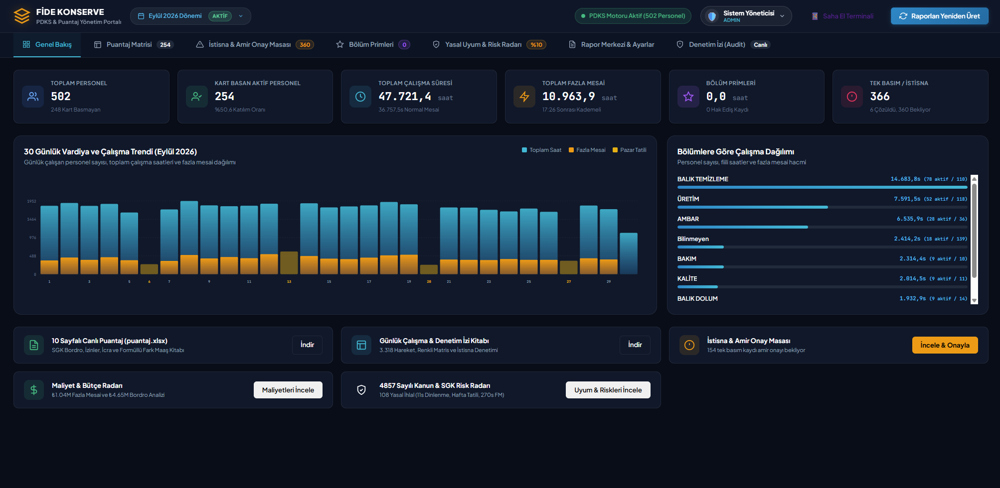
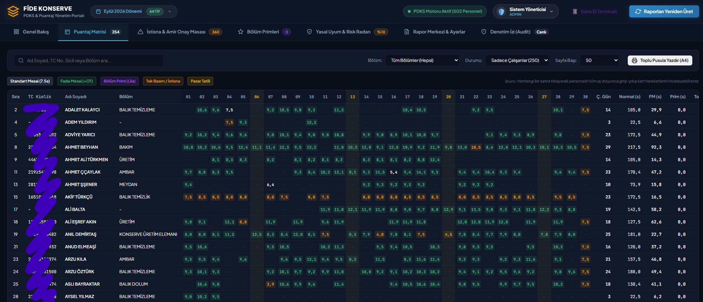
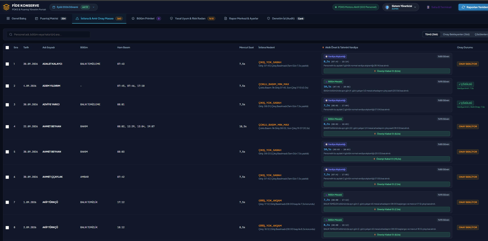
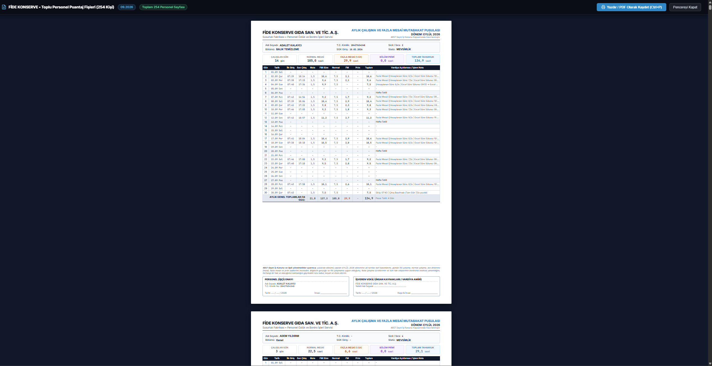
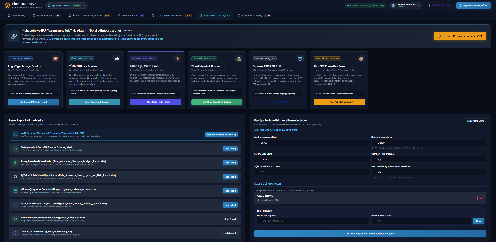
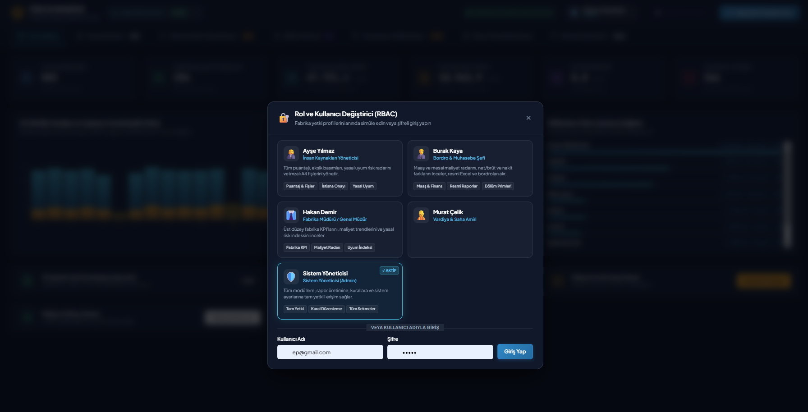

# 🏢 FİDE Konserve - Akıllı Puantaj ve PDKS Sistemi


FİDE Konserve için özel olarak geliştirilmiş; personel devam kontrol sistemi (PDKS) verilerini işleyen, vardiya sürelerini hesaplayan ve puantaj cetvellerini otomatik olarak hazırlayan akıllı otomasyon sistemidir.

---

## 🎯 Proje Özeti
Bu sistem, karmaşık personel giriş-çıkış verilerini analiz ederek, İnsan Kaynakları ve Muhasebe departmanları için puantaj hesaplama sürecini tam otomatik hale getirir. Excel ve CSV formatındaki karmaşık PDKS verilerini alır, akıllı algoritmalarla eksik veya hatalı basımları tespit eder, vardiyaları hesaplar ve ERP sistemlerine entegre edilebilir raporlar sunar.

## ✨ Temel Özellikler
- **🔄 Otomatik PDKS Analizi:** Personel kart basım verilerini (giriş-çıkış saatleri) otomatik yorumlama.
- **⏱️ Vardiya ve Mesai Hesaplama:** Normal çalışma, fazla mesai, pazar mesaisi ve gece vardiyası sürelerinin otomatik tespiti.
- **🛡️ Hata ve İstisna Yönetimi:** Kart basmayı unutan veya hatalı basım yapan personellerin durumlarını tespit edip raporlama.
- **📊 Gelişmiş Raporlama:** Excel formatında detaylı puantaj cetvelleri, günlük çalışma raporları ve maliyet analizleri oluşturma.
- **⚡ Hızlı ve Güvenilir:** Python, FastAPI ve Pandas altyapısıyla büyük veri setlerinde bile saniyeler içinde sonuç üretme.

---

## 📸 Arayüz ve Kullanım Demo

Sistemin web tabanlı arayüzü üzerinden PDKS verilerini yönetebilir ve detaylı raporlara tek tıkla ulaşabilirsiniz.

**🎥 Sistem Kullanım Videosu:**
<video width="100%" controls>
  <source src="assets/demo_video.mp4" type="video/mp4">
  Tarayıcınız video etiketini desteklemiyor.
</video>
<br>

**🖼️ Ekran Görüntüleri:**
<div align="center">
  
  
</div>
<br>
<div align="center">
  
  
</div>
<br>
<div align="center">
  
  
</div>

---

## 🚀 Kurulum ve Çalıştırma

Projeyi yerel ortamınızda çalıştırmak için aşağıdaki adımları izleyin:

1. **Gereksinimleri Yükleyin:**
```bash
pip install -r requirements.txt
```

2. **Kullanım Seçenekleri:**

* **Tüm raporları (Puantaj, Günlük, Basit) üretmek için:**
```bash
python run.py
```

* **Web Arayüzünü (Dashboard) Başlatmak İçin:**
```bash
python run.py --mode web
```
*(Alternatif olarak: `uvicorn app:app --reload`)*

* **Sadece belirli bir ay ve yıl için hesaplama yapmak:**
```bash
python run.py --month 10 --year 2026
```

* **Sadece birim testlerini (Unit Tests) çalıştırmak:**
```bash
python run.py --mode test
```

---

## 📁 Proje Yapısı

- `app.py`: FastAPI / Web Uygulama ana giriş noktası.
- `pdks_engine.py`: PDKS verilerini işleyen ve vardiyaları yorumlayan ana motor.
- `db_manager.py`: Veritabanı yönetim işlevleri ve kayıt saklama.
- `builder.py` / `slip_builder.py`: Rapor ve doküman oluşturucu modüller.
- `erp_exporter.py`: Çıktıların ERP sistemlerine aktarılması için aracı servis.
- `data/`: Örnek veri setleri ve JSON formatındaki istisna/ayar dosyaları.
- `tests/`: Sistem birim testleri.

---

## 📌 İletişim & Destek
Proje hakkında detaylı bilgi ve destek için geliştirici ekibi ile iletişime geçebilirsiniz.
